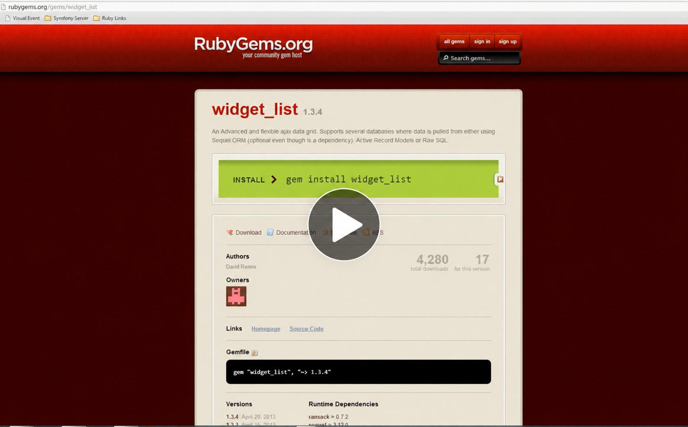

# widget_list Rails 8 caller — AI theme preview

This `codex/ai-theme-example` branch installs the in-development [widget_list_theme_ai](https://github.com/davidrenne/widget_list_theme_ai) gem and [widget_list](https://github.com/davidrenne/widget_list) from sibling checkouts. Its Sequel and Ransack pages use the same live lists as the base example, with a dark showcase shell and the theme's grid stylesheet. The administration console remains available in development and test. The core checkout includes a Ruby 3 pagination fix in 2.0.2 source. Keep the local paths until the updated core and theme are released.

The caller integration is visible in [Gemfile](Gemfile), [asset manifest](app/assets/config/manifest.js), and [layout](app/views/layouts/application.html.erb). The gem's stylesheet is loaded after `widget_list` and `widgets`; its Ruby defaults are loaded automatically. The hero, navigation, and page background in this example are app styles, separate from the theme gem.

This is a **fresh Rails 8.1.4 app generated with `rails new . --minimal --database=sqlite3`** and configured to use `widget_list`. It has three working pages:

- `/` — a Sequel SQL list with Ajax search, paging, sorting, and CSV export.
- `/ransack` — the same SQLite records through Active Record and Ransack. Open the down arrow beside the search field to add a filter such as **Name contains Apple**.
- `/administration` — the administration wizard: choose `Item`, configure fields and controls, preview the list, and generate starter controller code. This route exists only in development and test.

It uses Ruby 3.4.11, SQLite, Sequel 5.109.0, and Ransack 5.0.2. Rails 8.1 requires Ruby 3.2 or newer.

## Video demo

[](https://www.youtube.com/watch?v=A6mZa8Ge2Rk)

This video shows the original 1.x interface. The pages in this app demonstrate the current Rails 8 integration.

## Run it

Clone all three repositories into the same parent directory, then run the example:

```sh
git clone https://github.com/davidrenne/widget_list_example_rails8.git
git clone https://github.com/davidrenne/widget_list_theme_ai.git
git clone https://github.com/davidrenne/widget_list.git
cd widget_list_example_rails8
git switch codex/ai-theme-example
cd ../widget_list_theme_ai && git switch codex/ai-theme && cd ../widget_list_example_rails8
bundle install
bin/rails db:prepare
bin/rails db:seed
bin/rails test
bin/rails server
```

Open [http://127.0.0.1:3000/](http://127.0.0.1:3000/), [http://127.0.0.1:3000/ransack](http://127.0.0.1:3000/ransack), and [http://127.0.0.1:3000/administration](http://127.0.0.1:3000/administration). Search for SKU `1001` on the first page or filter Name to `Apple` on the second. The two list pages also link to the administration console.

The [Gemfile](Gemfile) loads the theme from `../widget_list_theme_ai` and the core gem from `../widget_list`. After releases, replace those two path lines with versioned RubyGems dependencies.

## Changes to make in your own Rails app

1. Add `sprockets-rails`, `jquery-rails`, and the two local gem paths in [the Gemfile](Gemfile). Replace Rails 8's default `propshaft` entry with `sprockets-rails`.
2. Add [the asset manifest](app/assets/config/manifest.js) and [JavaScript entry point](app/assets/javascripts/application.js). Include `application.js`, `widget_list.css`, `widgets.css`, and `widget_list_theme_ai.css` in [the layout](app/views/layouts/application.html.erb), with the theme last. Load `application.js` without `defer` so the wizard's inline script sees jQuery. The gems compile their own asset paths; there is no image copy step.
3. If using Sequel, add [the database mapping](config/widget-list.yml): a Sequel URI as `:primary`, and an Active Record environment name as `:secondary`. Point SQLite at the same file as [Rails database.yml](config/database.yml). For Active Record only, this file is optional and the gem uses the current Rails database as primary.
4. Add a model and allowlist the columns Ransack may search, as [Item](app/models/item.rb) does. Apply [the migration](db/migrate/20261006182200_create_items.rb) and create data with [the seeds](db/seeds.rb).
5. Add GET and POST routes for each list endpoint, as in [routes.rb](config/routes.rb). `widget_list` posts Ajax search and paging requests back to the same action. Build the list in [ItemsController](app/controllers/items_controller.rb), handle its `html`, `json`, and `export` return types, and render `@output` in the corresponding view.
6. For the wizard, add the development/test only `/administration` GET/POST route in [routes.rb](config/routes.rb), the [administration action](app/controllers/widget_list_examples_controller.rb), the [view that renders `@output`](app/views/widget_list_examples/administration.html.erb), and a link from your list page. Render JSON for both wizard setup requests (`ajax`) and preview list requests (`BUTTON_VALUE`), as the controller does. The wizard writes `config/widget-list-administration.json` and `config/widget-list-administration-all.json`; keep them local with the [Git ignore rules](.gitignore). Restrict the route to trusted developers because previewing generated code evaluates Ruby and the wizard writes files.

The console selects an Active Record model; with this app's Sequel `primary` and Active Record `secondary`, leave **Primary Connection?** unchecked. The wizard now defaults to that setting. `Item` defines the Ransack allowlist used by generated lists. Review generated links and controller code before copying it into another action. The [gem README](https://github.com/davidrenne/widget_list#administration-console) has copyable setup code and all six original administration screenshots.


*The screenshot is from the original Rails 3 era interface; this app runs the restored wizard on Rails 8.*

The [gem README](https://github.com/davidrenne/widget_list#add-it-to-a-rails-8-app) includes copyable snippets and notes on the two database modes. The original integration is in one commit, `93c015f`. To inspect the original integration and the administration update, run:

```sh
git show --stat 93c015f
git diff dce9dd4..HEAD -- Gemfile app config/widget-list.yml config/routes.rb db test
git show --stat HEAD
```

`dce9dd4` is this repo's initial README-only commit. The diff shows the generated Rails app plus the caller integration. The latest commit shows the administration caller changes. The tests in `test/integration/widget_list_test.rb` exercise rendering, SKU Ajax search, Ransack filtering, CSV export, the administration preview, and generated controller code.
